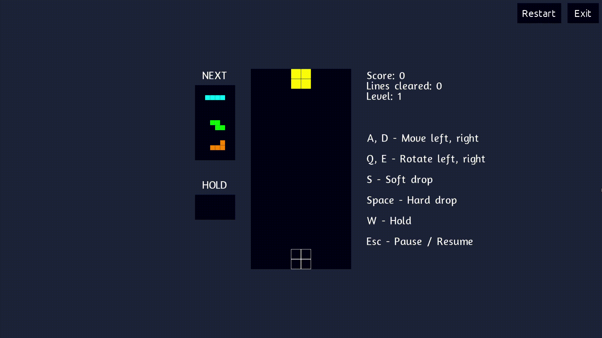

# Tetris

An attempt at recreating the classic **Tetris** using **[Evolve Engine](https://github.com/shubha360/Evolve-Engine)**.

This project is licensed under the **[MIT License](LICENSE)**. You are welcome to make or propose any changes or improvements.

## Notable Features

- The next 3 tetrominoes to spawn are visible to the player in advance.
- One tetromino can be held for later.
  
## Preview

Copyright (c) 2024 Raquibul Islam
